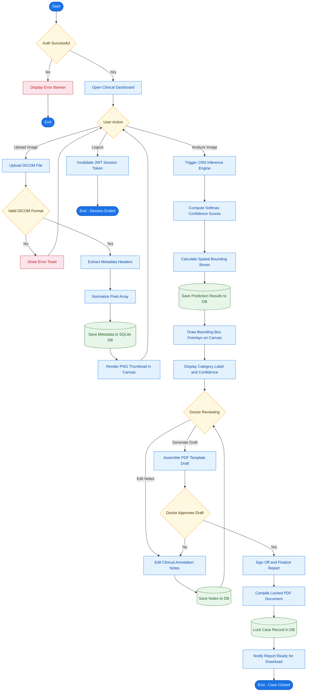

# Activity Diagram - Image Processing Workflow
## Medical Image-Based Disease Detection and Classification System

**Diagram Type:** Activity / Workflow  
**Version:** v1.0.0  
**Date:** June 5, 2026  

---

## End-to-End Clinical Workflow

---

## Legend

| Color | Node Type | Examples |
| :--- | :--- | :--- |
| 🔵 Blue (filled) | Start / End terminals | Start, End |
| 🔵 Blue (outline) | Process steps | Upload, Normalize, CompilePDF |
| 🟡 Amber | Decision points | Auth Check, Valid DICOM, Doctor Review |
| 🟢 Green | Database operations | Save Metadata, Save Results, Lock Record |
| 🔴 Red | Error states | Display Error Banner, Show Error Toast |

---

## Swimlane Summary

| Phase | Actor | Key Activities |
| :--- | :--- | :--- |
| **Authentication** | Any Role | Login, JWT issuance, session management |
| **Image Upload** | Radiologist | DICOM validation, metadata extraction, thumbnail rendering |
| **AI Analysis** | System (Automated) | CNN inference, softmax scoring, bounding box generation |
| **Review and Annotation** | Doctor | Clinical notes entry, draft PDF generation, sign-off |
| **Report Finalization** | System | PDF compilation, DB lock, notification |

---

> [!NOTE]
> This diagram is rendered via Mermaid.js. For print/export, save as `activity_preprocess_workflow.png`.
