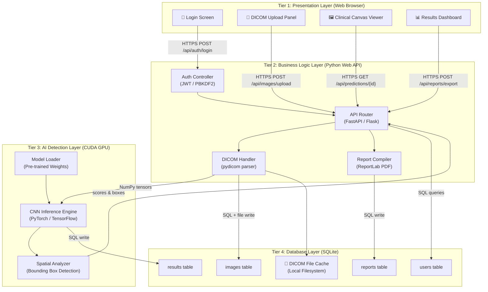

# System Architecture Diagram
## Medical Image-Based Disease Detection and Classification System

**Diagram Type:** Architecture Overview  
**Version:** v1.0.0  
**Date:** June 5, 2026  

---

## 4-Tier System Architecture

---

## Component Communication Summary

| Source | Destination | Protocol / Method |
| :--- | :--- | :--- |
| Web Browser | Backend API | HTTPS / RESTful JSON |
| Backend API | AI Engine | Internal Python memory (NumPy arrays) |
| Backend API | SQLite DB | SQL queries via SQLite3 |
| AI Engine | GPU Memory | CUDA kernel operations |
| DICOM Handler | Local Storage | OS filesystem read/write |

---

> [!NOTE]
> This diagram is rendered via Mermaid.js in markdown viewers (GitHub, GitLab, VS Code with Mermaid extension).
> The equivalent PNG export should be saved as `architecture_system_layers.png` in this directory for PDF inclusions.
