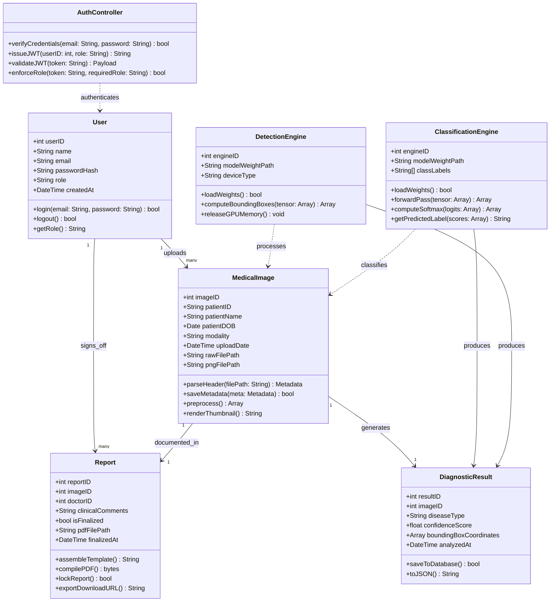

# Class Diagram – System Object Model
## Medical Image-Based Disease Detection and Classification System

**Diagram Type:** UML Class Diagram  
**Version:** v1.0.0  
**Date:** June 5, 2026  

---

## Class Diagram

---

## Key Method Descriptions

| Class | Method | Responsibility |
| :--- | :--- | :--- |
| `User` | `login()` | Verifies credentials and initiates session |
| `MedicalImage` | `preprocess()` | Returns normalized NumPy tensor from DICOM pixel data |
| `DetectionEngine` | `computeBoundingBoxes()` | Returns `[[xmin, ymin, xmax, ymax], ...]` array |
| `ClassificationEngine` | `computeSoftmax()` | Converts raw logits to confidence probability array |
| `Report` | `compilePDF()` | Returns binary PDF bytes from assembled template |
| `AuthController` | `enforceRole()` | Blocks non-authorized roles from clinical endpoints |

---

> [!NOTE]
> This diagram is rendered via Mermaid.js. For print/export, save as `class_detection_engine.png`.
