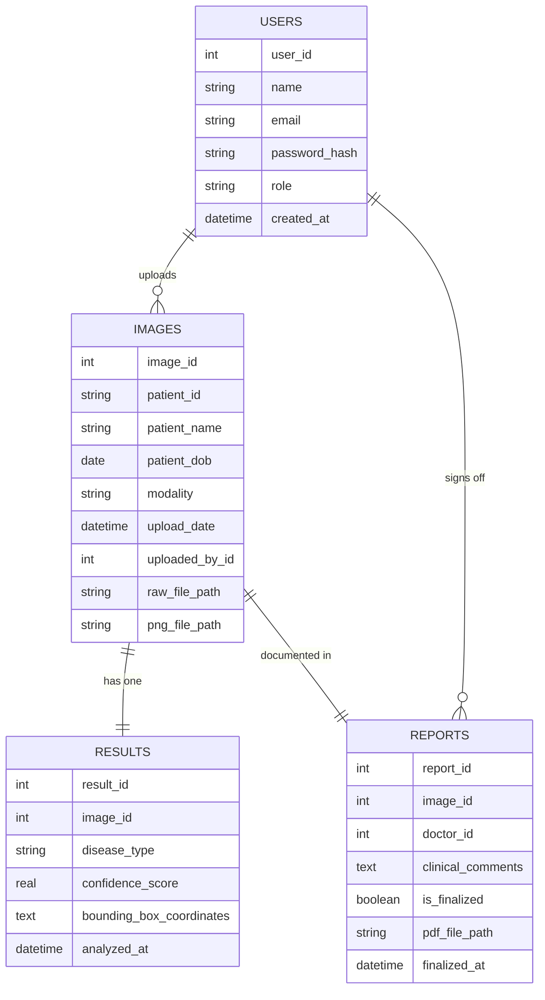

# Entity Relationship Diagram (ERD) - Database Schema
## Medical Image-Based Disease Detection and Classification System

**Diagram Type:** Entity Relationship (ERD)  
**Version:** v1.0.0  
**Date:** June 5, 2026  

---

## Database ERD

---

## Table Schema Details

| Table | Column | Type | Constraint |
| :--- | :--- | :--- | :--- |
| `users` | `user_id` | INTEGER | PRIMARY KEY AUTOINCREMENT |
| `users` | `email` | VARCHAR(100) | UNIQUE, NOT NULL |
| `users` | `role` | VARCHAR(20) | Admin, Doctor, or Radiologist |
| `images` | `image_id` | INTEGER | PRIMARY KEY AUTOINCREMENT |
| `images` | `uploaded_by_id` | INTEGER | FOREIGN KEY → users.user_id |
| `results` | `image_id` | INTEGER | UNIQUE FK → images.image_id |
| `results` | `confidence_score` | REAL | Range 0.0 to 1.0 |
| `reports` | `image_id` | INTEGER | UNIQUE FK → images.image_id |
| `reports` | `is_finalized` | BOOLEAN | DEFAULT FALSE |

## Table Index Summary

| Index Name | Table | Column(s) | Purpose |
| :--- | :--- | :--- | :--- |
| `idx_users_email` | `users` | `email` | Fast login authentication queries |
| `idx_images_patient_id` | `images` | `patient_id` | Quick patient case history lookup |
| `idx_images_uploaded_by_id` | `images` | `uploaded_by_id` | Filter scans by uploading clinician |
| `idx_results_image_id` | `results` | `image_id` | Fast AI result display on dashboard |
| `idx_reports_image_id` | `reports` | `image_id` | Quick report sign-off status check |

---

> [!NOTE]
> This ERD is rendered via Mermaid.js. For print/export, save as `database_schema_erd.png`.
> Field constraint details (PK, FK, NOT NULL) are listed in the table above since inline annotations are not supported in Mermaid v8.8.0.
