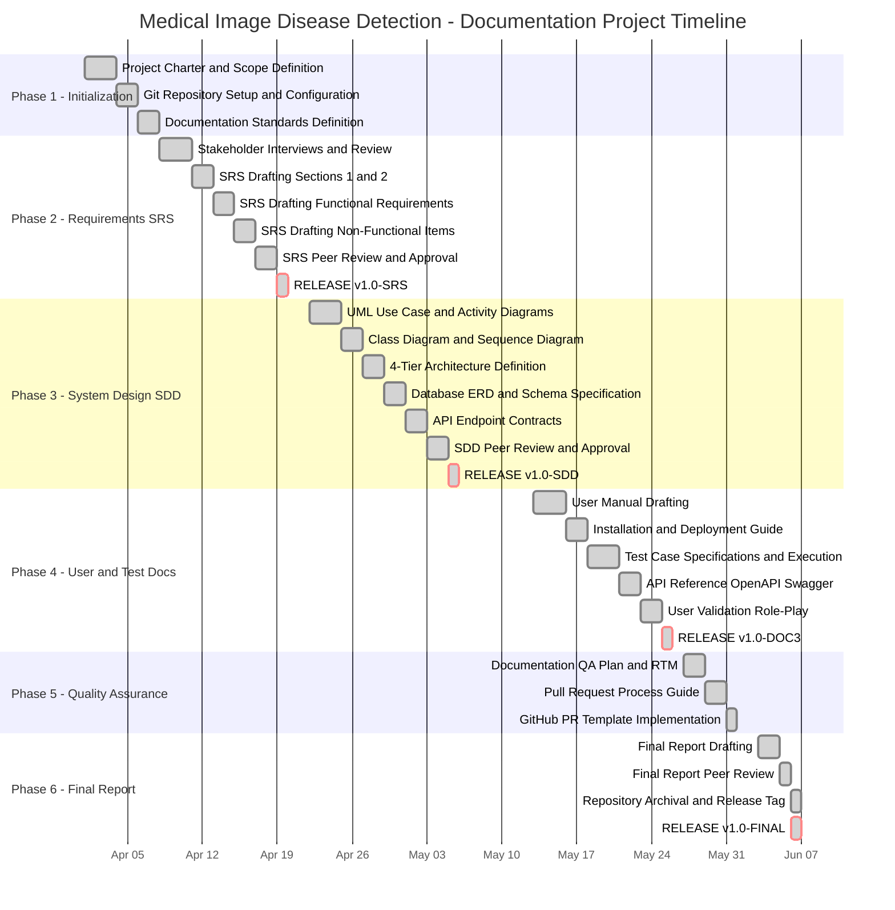

# Project Gantt Chart
## Medical Image-Based Disease Detection and Classification System

**Diagram Type:** Project Timeline / Gantt Chart  
**Version:** v1.0.0  
**Date:** June 5, 2026  

---

## 8-Week Project Gantt Chart

---

## Milestone Summary

| Milestone | Tag | Target Date | Status |
| :--- | :--- | :--- | :---: |
| Requirements Baseline | `v1.0-SRS` | Week 3 End | ✅ PASSED |
| System Design Baseline | `v1.0-SDD` | Week 5 End | ✅ PASSED |
| Documentation Suite Baseline | `v1.0-DOC3` | Week 7 End | ✅ PASSED |
| Final Project Release | `v1.0-FINAL` | Week 8 End | ✅ PASSED |

---

> [!NOTE]
> This Gantt chart is rendered via Mermaid.js. For print/export, save as `gantt_project_timeline.png`.
