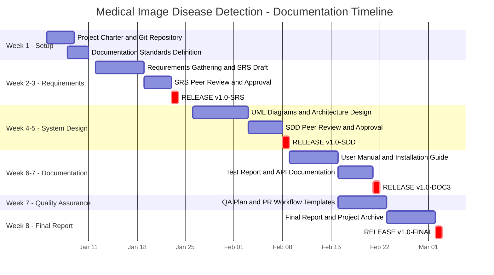

# Project Gantt Chart
## Medical Image-Based Disease Detection and Classification System

**Diagram Type:** Project Timeline / Gantt Chart  
**Version:** v1.0.0  
**Date:** June 5, 2026  

---

## 8-Week Project Gantt Chart

---

## Milestone Summary

| Milestone | Tag | Timeline | Status |
| :--- | :--- | :--- | :---: |
| Requirements Baseline | `v1.0-SRS` | End of Week 3 | ✅ PASSED |
| System Design Baseline | `v1.0-SDD` | End of Week 5 | ✅ PASSED |
| Documentation Suite Baseline | `v1.0-DOC3` | End of Week 7 | ✅ PASSED |
| Final Project Release | `v1.0-FINAL` | End of Week 8 | ✅ PASSED |

---

> [!NOTE]
> Blue bars = work tasks. Red bars = release milestones (`:crit`).
