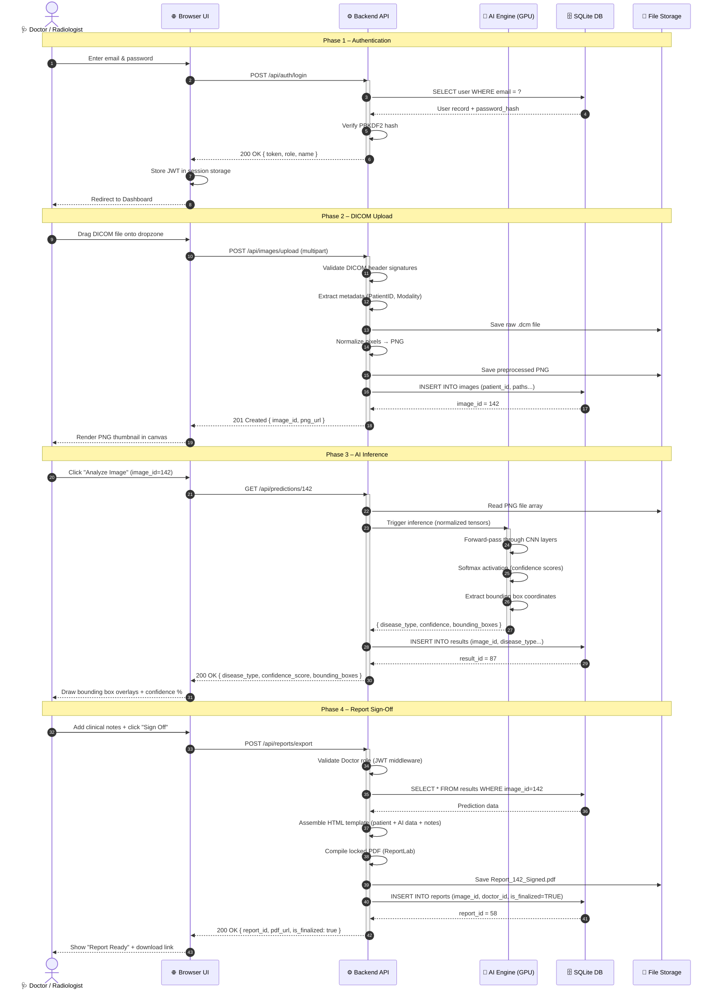

# Sequence Diagram – Image Upload & Classification Flow
## Medical Image-Based Disease Detection and Classification System

**Diagram Type:** UML Sequence  
**Version:** v1.0.0  
**Date:** June 5, 2026  

---

## Runtime Communication Sequence

---

> [!NOTE]
> This diagram is rendered via Mermaid.js. For print/export, save as `sequence_image_upload.png`.
