# UML Use Case Diagram
## Medical Image-Based Disease Detection and Classification System

**Diagram Type:** Use Case  
**Version:** v1.0.0  
**Date:** June 5, 2026  

---

## Use Case Diagram

```mermaid
graph TD
    classDef actor fill:#1a73e8,stroke:#0d47a1,color:#ffffff
    classDef uc fill:#e8f5e9,stroke:#2e7d32,color:#1b5e20
    classDef ucAdmin fill:#e3f2fd,stroke:#1a73e8,color:#0d47a1
    classDef ucClinical fill:#fff8e1,stroke:#f9a825,color:#4a3000

    Admin(["Administrator"]):::actor
    Doctor(["Doctor"]):::actor
    Radiologist(["Radiologist"]):::actor

    subgraph "Medical Image Classification System"
        UC1("UC-01: Authenticate and Login"):::uc
        UC2("UC-02: Upload DICOM Image"):::ucClinical
        UC3("UC-03: Run AI Inference"):::ucClinical
        UC4("UC-04: View Scan and Annotations"):::ucClinical
        UC5("UC-05: Edit Clinical Notes"):::ucClinical
        UC6("UC-06: Sign Off and Export PDF Report"):::ucClinical
        UC7("UC-07: Manage User Accounts"):::ucAdmin
        UC8("UC-08: View Audit Logs"):::ucAdmin
    end

    Admin --- UC1
    Admin --- UC7
    Admin --- UC8

    Doctor --- UC1
    Doctor --- UC4
    Doctor --- UC5
    Doctor --- UC6

    Radiologist --- UC1
    Radiologist --- UC2
    Radiologist --- UC3
    Radiologist --- UC4
    Radiologist --- UC5
```

---

## Color Legend

| Color | Meaning |
| :--- | :--- |
| 🔵 Blue (filled) | System actors (users) |
| 🟢 Green (outline) | Shared use cases (all roles) |
| 🔵 Blue (outline) | Administrator-only use cases |
| 🟡 Amber | Clinical workflow use cases |

## Use Case Descriptions

| Use Case ID | Title | Primary Actor | Precondition | Postcondition |
| :--- | :--- | :--- | :--- | :--- |
| **UC-01** | Authenticate and Login | All Roles | System is running | JWT session token issued |
| **UC-02** | Upload DICOM Image | Radiologist | Logged-in session | Image stored, metadata parsed |
| **UC-03** | Run AI Inference | Radiologist | Image uploaded | Bounding boxes and confidence scores returned |
| **UC-04** | View Scan and Annotations | Doctor, Radiologist | Inference completed | Canvas with overlays displayed |
| **UC-05** | Edit Clinical Notes | Doctor, Radiologist | Case open in dashboard | Notes saved to DB |
| **UC-06** | Sign Off and Export PDF | Doctor | Notes added | PDF compiled and case locked |
| **UC-07** | Manage User Accounts | Administrator | Admin session active | User records updated |
| **UC-08** | View Audit Logs | Administrator | Admin session active | Audit log report viewed |

---

> [!NOTE]
> This diagram is rendered via Mermaid.js. For print/export, save as `usecase_doctor_interaction.png`.
