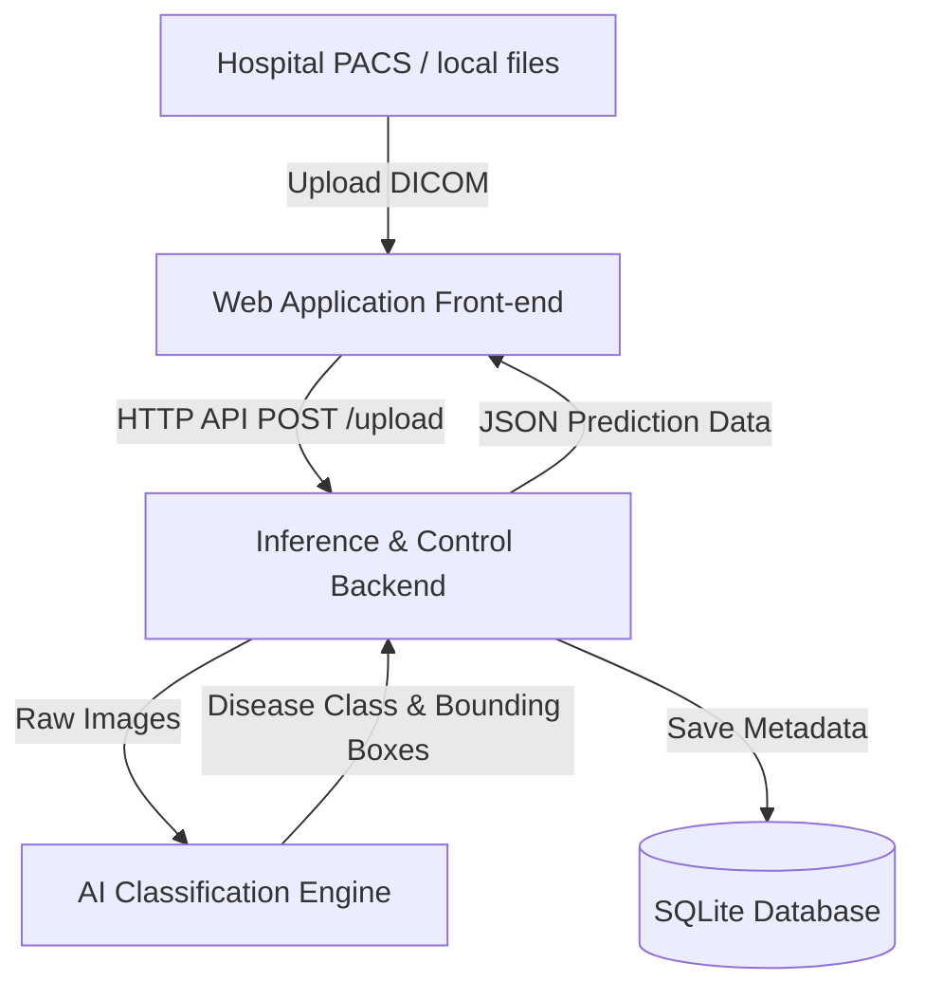

# Software Requirements Specification (SRS)
## Medical Image-Based Disease Detection and Classification System

---

## 1. Introduction

### 1.1 Purpose
This Software Requirements Specification (SRS) document defines the complete functional, non-functional, interface, and safety requirements for the **Medical Image-Based Disease Detection and Classification System**. The purpose of this system is to provide automated detection and classification of pathological conditions from medical imaging inputs to assist clinical workflows and radiologists.

### 1.2 Document Audience
This document is structured to serve several key stakeholders, each focusing on specific sections:
- **Client / Hospital Representative:** Reviews the document to ensure that system features, clinical objectives, and operational constraints are fully aligned with the clinical environment.
- **Project Supervisor:** Audits the requirements for academic rigor, standards compliance, and compliance with the project plan.
- **Development Team:** Refers to functional and system interface specifications to implement the system database, API endpoints, user interfaces, and model pipelines.
- **Quality Assurance (QA) / Testing Team:** Uses the requirements as the baseline for designing unit tests, integration tests, and validating the final system outputs.

### 1.3 Intended Objectives
The system aims to achieve the following core objectives:
- **Clinical Decision Support:** Offer automated, secondary review assistance to radiologists and physicians to reduce diagnosis error rates.
- **Efficiency Enhancement:** Decrease the average time required to review medical scans and generate diagnostic reports.
- **Robust Medical Classification:** Deliver high-accuracy, multi-class disease classification (e.g., distinguishing between normal tissue, benign tumors, and malignant lesions) from medical images (e.g., MRI, CT, X-Ray scans).
- **Standards-Compliant Data Management:** Integrate with standard clinical formats (e.g., DICOM) to ensure interoperability and secure data sharing.

### 1.4 Scope of System
- **In-Scope:**
  - Secure uploading and parsing of standard medical image files (primarily DICOM formats).
  - Preprocessing of raw images (e.g., resizing, normalization, noise reduction).
  - Execution of deep learning classifiers to detect specific pathological features.
  - Interactive doctor/radiologist dashboard showing disease classification results, confidence scores, and bounding boxes around detected regions.
  - Automated PDF report generation with doctor sign-off capabilities.
  - Role-based user authentication and access control (Administrator, Doctor, Radiologist).
- **Out-of-Scope:**
  - Real-time video/ultrasound streaming analysis.
  - Direct write-back integrations into hospital PACS (Picture Archiving and Communication Systems) or EHR (Electronic Health Records) databases (this is treated as a separate enterprise middleware concern).
  - General patient billing and hospital management workflows.

### 1.5 Definitions, Acronyms, and Abbreviations

| Acronym / Term | Definition |
| :--- | :--- |
| **SRS** | Software Requirements Specification |
| **DICOM** | Digital Imaging and Communications in Medicine (international standard for medical images) |
| **PACS** | Picture Archiving and Communication System |
| **CNN** | Convolutional Neural Network |
| **AI** | Artificial Intelligence |
| **QA** | Quality Assurance |
| **UML** | Unified Modeling Language |
| **EHR** | Electronic Health Record |
| **mIoU** | Mean Intersection over Union (a common semantic segmentation evaluation metric) |
| **OA** | Overall Accuracy |

### 1.6 References
1. **IEEE Std 830-1998:** IEEE Recommended Practice for Software Requirements Specifications.
2. **DICOM Standard (PS3):** NEMA Digital Imaging and Communications in Medicine Committee.
3. **ISO 13485:** Medical devices — Quality management systems — Requirements for regulatory purposes.
4. **Project Master Plan:** [plan.md](../../plan.md) - Project master schedule and deliverable requirements.
5. **Documentation Standards:** [Documentation_Standards.md](../Documentation_Standards.md) - Naming conventions and style guidelines.

---

## 2. Overall Description

### 2.1 Product Perspective
The Medical Image-Based Disease Detection and Classification System operates as an autonomous web-based platform with a dedicated deep-learning inference backend. The system is designed to interface with DICOM source images, preprocess the visual payloads, feed them to a localized AI analysis server, and display output classification parameters on an interactive clinical dashboard.

### 2.2 Product Functions
The high-level capabilities of the system are categorized as follows:
- **User Authentication and Administration:** Secure role-based login, session verification, and account profile controls.
- **Image Importation and Preprocessing:** Reading multi-frame or single-frame DICOM slices, extracting patient metadata headers, and applying spatial rescaling, contrast adjustment, and noise filtering.
- **Disease Area Detection:** Identifying bounding regions of pathological interest (e.g., lesions, tumors, fractures) and overlaying heatmap/bounding-box visual markers.
- **Disease Multi-Class Classification:** Assisting diagnostic analysis by classifying scans into distinct clinical labels (e.g., Normal, Benign, Malignant) accompanied by statistical confidence levels.
- **Dashboard Reporting & Audit trail:** Presenting visual overlays side-by-side with Patient IDs, demographic records, and confidence statistics.
- **Diagnostic Exporting:** Building formatted summary reports in PDF format containing physician comments and signature fields.

### 2.3 User Classes and Characteristics
- **Administrators:** Responsible for system maintenance, user registration control, database backup, audit log review, and configuring system security levels.
- **Radiologists:** Heavy-use clinical staff who upload scan archives, trigger model executions, examine visual bounding boxes, and formulate diagnosis drafts.
- **Doctors:** Clinical recipients who retrieve cases, review the classification results and radiologists' notes, add final diagnosis annotations, and approve PDF reports.

### 2.4 Operating Environment
- **Server Infrastructure:**
  - **Operating System:** Ubuntu 22.04 LTS or compatible server OS.
  - **Runtime Runtime:** Python 3.10+ with PyTorch/TensorFlow.
  - **Database:** SQLite for lightweight local caching, or PostgreSQL for enterprise-grade deployments.
  - **Hardware acceleration:** NVIDIA CUDA-enabled GPU with >= 8GB VRAM.
- **Client Interface:**
  - Standard modern web browsers (Chrome 110+, Edge 110+, Firefox 105+, Safari 16+).
  - Responsive layout designed for desktop display resolutions (>= 1280x720).

### 2.5 Design and Implementation Constraints
- **Regulatory Compliance:** Must adhere to data isolation and privacy mandates under HIPAA (Health Insurance Portability and Accountability Act) and GDPR.
- **Image Dimensionality Limits:** Maximum size of uploaded DICOM batches is capped at 100MB per session to prevent backend memory overflows.
- **Latency Boundaries:** Deep learning inference execution must compile and return scores within 5 seconds of the image upload completion.
- **Accessibility:** Text elements and UI layouts must satisfy WCAG 2.1 AA web accessibility guidelines.

### 2.6 Assumptions and Dependencies
- **Data Integrity:** Uploaded medical images are assumed to conform to the standard DICOM metadata specifications without header corruption.
- **Active Connection:** The system assumes constant backend availability and network connectivity for transferring image payloads from the web application interface.
- **Pre-trained Weights:** The system depends on pre-trained neural network weights being correctly mounted and loaded into host VRAM at server startup.
