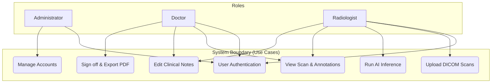
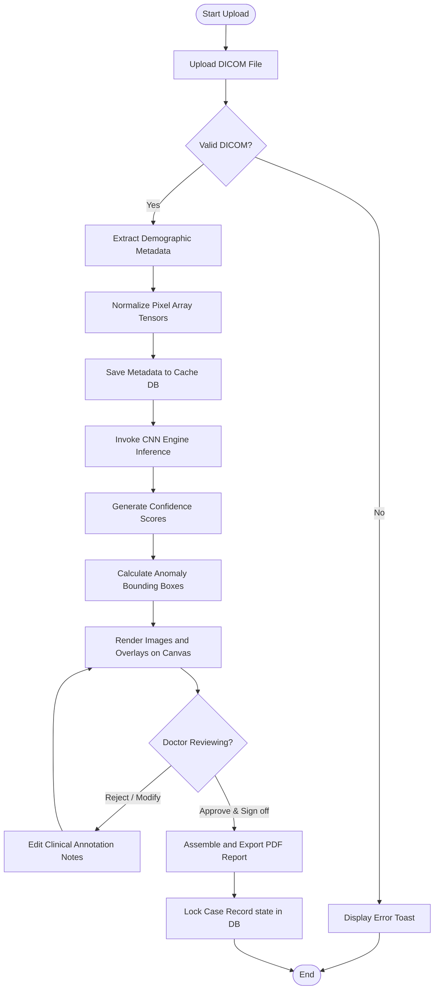
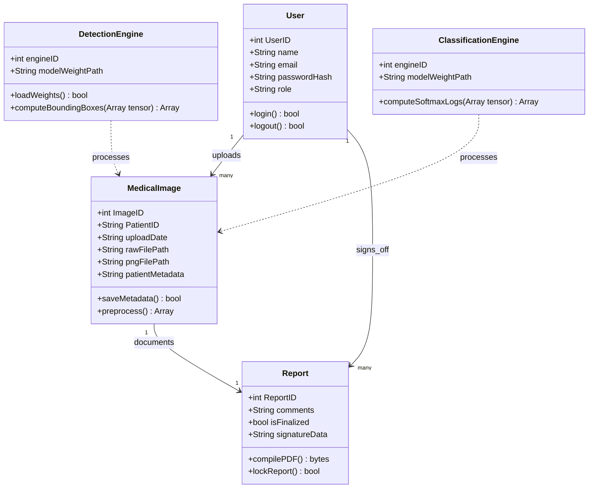
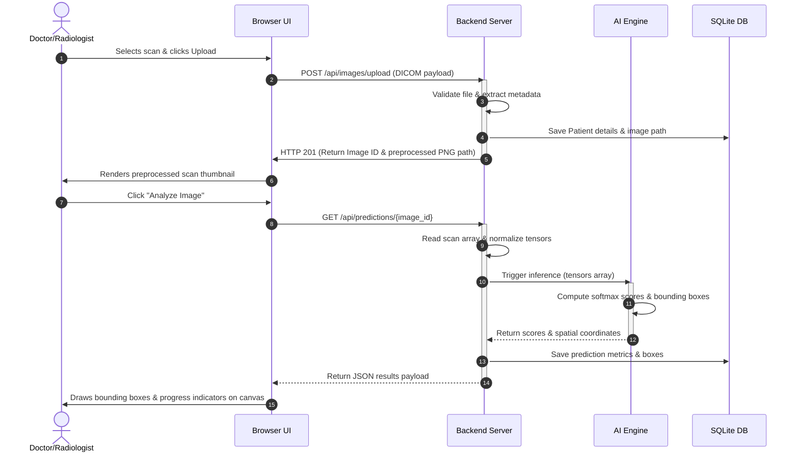

# Software Design Document (SDD)
## Medical Image-Based Disease Detection and Classification System

---

## 1. Introduction

### 1.1 Purpose
This Software Design Document (SDD) provides a comprehensive description of the architectural design, component decomposition, database structure, and external interfaces for the **Medical Image-Based Disease Detection and Classification System**. It translates the requirements outlined in the Software Requirements Specification (SRS) into structured technical blueprints for implementation.

### 1.2 Document Audience
This document is designed for the following technical stakeholders:
- **System Developers:** To implement modular backend interfaces, construct model execution pipelines, design database adapter structures, and build front-end layouts.
- **Quality Assurance (QA) / Testers:** To design detailed test integration suites, trace code components back to requirements, and run component validations.
- **System Administrators:** To understand deployment environments, network protocols, server GPU setups, and data security dependencies.
- **Project Supervisor:** To verify system design feasibility, compliance with documentation standards, and architectural completeness.

### 1.3 Scope of Design
The design specifications cover:
- Layered architectural boundaries (Presentation Layer, Application Logic Layer, AI Model Inference Layer, and Persistence Layer).
- Modular decomposition of system features (Authentication, DICOM Parsing, Neural Network classification, Canvas Rendering, and PDF report compilation).
- UML Design models showing workflows, actors, class behaviors, and execution sequences.
- Relational database schema structure.
- REST API endpoint contracts and JSON schema payload formats.

---

## 2. System Component Decomposition

To satisfy the functional requirements (FR-01 to FR-05) defined in the SRS, the system is decomposed into six main functional modules:

```text
+-------------------------------------------------------------+
|                     Presentation Layer                      |
|  - Login View      - Case List View     - Clinical Canvas   |
+------------------------------+------------------------------+
                               | API Requests (HTTPS)
                               v
+-------------------------------------------------------------+
|                  Application Logic Layer                    |
|  - Auth Controller              - Image Manager Controller  |
|  - Report Compiler Module       - Database Adapter          |
+--------------------+---------------------+------------------+
                     |                     |
   Tensors via NumPy v                     v DB Operations
+--------------------------+    +-----------------------------+
|    AI Inference Layer    |    |      Persistence Layer      |
|  - Model Loader Node     |    |  - SQLite Database Engine   |
|  - Classification Pipeline|   |  - DICOM File System Cache  |
+--------------------------+    +-----------------------------+
```

### 2.1 Presentation Component (Client Interface)
- **Role:** Handles rendering the browser viewport and managing asynchronous client-side routing.
- **Sub-modules:**
  - *Authentication Panel:* Interface for email/password credentials input and session storage.
  - *Patient Archive Panel:* Lists uploaded case metadata matching user filter parameters.
  - *Interactive Canvas Viewer:* Draws the raw preprocessed medical scan and maps bounding box coordinates visually.
  - *Diagnosis Control Hub:* Panel containing clinical logs, confidence ratings, and diagnostic export controls.

### 2.2 Authentication & Access Control Module
- **Role:** Authenticates user credentials, generates JSON Web Tokens (JWT), and checks route permission roles.
- **Sub-modules:**
  - *Credentials Verifier:* Manages password hashing verification using PBKDF2.
  - *Token Controller:* Issues, decodes, and checks expiration of JWT session tokens.
  - *Middleware Guard:* Enforces clinical path restrictions (e.g. preventing Radiologists from signing final reports).

### 2.3 Image Importation & Storage Manager
- **Role:** Handles file system upload processes, DICOM file validation, header parsing, and cache allocation.
- **Sub-modules:**
  - *DICOM Header Parser:* Extracts tags (Patient ID, Study Date, Modality) using `pydicom`.
  - *Preprocessing Normalizer:* Converts pixel arrays to normalized float matrices for model compatibility, and compresses raw pixels to PNG formats for web client presentation.
  - *Cache Manager:* Allocates local disk storage for DICOM binaries.

### 2.4 AI Model Inference Engine
- **Role:** Manages ML model lifecycle, runs inference checks on preprocessed tensors, and maps spatial anomaly areas.
- **Sub-modules:**
  - *Model Loader:* Mounts pre-trained network model weights into GPU memory at server startup.
  - *Inference Classifier:* Runs forward-pass operations and maps logits using softmax.
  - *Spatial Analyzer:* Calculates pixel coordinate arrays corresponding to anomalous regions.

### 2.5 Report Compiler Module
- **Role:** Assembles diagnostic summaries, doctor notes, and visual findings into a locked PDF format.
- **Sub-modules:**
  - *Template Engine:* Assembles layout variables into standardized markup.
  - *PDF Generator:* Compiles text and images to PDF binaries using `ReportLab`.
  - *Locker Module:* Tags DB records as finalized and disables further editing.

### 2.6 Persistence & DB Adapter
- **Role:** Abstracts data operations through structured queries.
- **Sub-modules:**
  - *User Schema Manager:* Manages database profiles, password hashes, and access permissions.
  - *Image Metadata Manager:* Handles Patient IDs, dates, file locations, and status records.
  - *Results Schema Manager:* Manages category tags, confidence levels, and coordinate outputs.

---

## 3. Design Models & UML Diagrams

We use standard Mermaid.js syntax to model system processes, structure, and database relations. These diagrams render natively within markdown-supported environments.

### 3.1 Use Case Diagram
This model maps permissions, boundaries, and system goals relative to the core client roles.



### 3.2 Activity Diagram
This workflow describes the end-to-end data lifecycle from scan importation, classification, annotation editing, to report compilation.



### 3.3 Class Diagram
This structural diagram outlines object schemas, core system fields, operation types, and their relationships.



### 3.4 Sequence Diagram
This interaction trace defines call structures and lifelines during scan uploads and prediction renders.



---

## 4. System Architecture

The system is designed around a **decoupled 4-Tier Layered Architecture** to enforce separation of concerns, improve maintainability, and ensure that resource-intensive deep learning inference does not block client UI updates or database operations.

```text
+-------------------------------------------------------------+
| Presentation Layer (Web Client Interface)                   |
| - Vanilla JS Runtime   - HTML5 Canvas   - CSS Layouts       |
+------------------------------+------------------------------+
                               | HTTPS Requests (JSON payloads)
                               v
+-------------------------------------------------------------+
| Business Logic Layer (Python Web API Backend)              |
| - Request Routers      - JWT Middleware - DICOM Parser      |
+--------------------+---------------------+------------------+
                     |                     |
     NumPy Tensors   v                     v Local SQLite Queries
+--------------------------+    +-----------------------------+
| AI Detection Layer       |    | Database Layer              |
| - PyTorch CNN Engine     |    | - SQLite Persistence        |
| - CUDA Hardware Driver   |    | - DICOM Local Storage       |
+--------------------------+    +-----------------------------+
```

### 4.1 Architecture Overview
By separating the presentation, business logic, AI execution, and data storage:
- **Scalability:** The AI execution module can run on dedicated GPU hardware nodes while the backend and frontend run on lightweight web server instances.
- **Resilience:** Model exceptions or memory crashes are isolated to the AI detection layer, allowing the web server to remain operational.
- **Traceability:** UI client elements do not interact directly with the database, maintaining security boundaries.

### 4.2 Presentation Layer
The front-end client interface operates entirely within the user's web browser:
- **Technology Stack:** HTML5, CSS3 (Vanilla stylesheets), and Vanilla ES6 JavaScript (avoiding heavy external framework dependencies to maintain minimal bundle sizes).
- **Core Responsibilities:**
  - **Session Controller:** Securely manages token authentication (storing JWTs in session storage) and page redirect routing.
  - **DICOM Canvas Renderer:** Renders pixel matrices side-by-side with demographic details, and draws canvas bounding box outlines indicating pathological zones.
  - **UI Events Handler:** Manages interactive user features, file selection drag-and-drop actions, and API request status notifications (loading spinners, error banners).

### 4.3 Business Logic Layer
The backend application server handles API request management and coordinates application workflows:
- **Technology Stack:** Python 3.10+ (utilizing frameworks like FastAPI or Flask).
- **Core Responsibilities:**
  - **Router & Auth Controller:** Matches HTTP endpoints, parses incoming JSON payloads, and validates JWT headers to block unauthorized users.
  - **DICOM Handler:** Processes raw binary uploads, extracts patient information tags, writes files to local storage, and normalizes pixel data.
  - **Report Compiler:** Packages patient details, model classification logs, and doctor feedback notes into secure, locked PDF files using the `ReportLab` library.

### 4.4 AI Detection Layer
The inference engine encapsulates the deep learning model pipeline:
- **Technology Stack:** Python, PyTorch (Deep Learning framework), NumPy (tensor processing), and NVIDIA CUDA hardware drivers.
- **Core Responsibilities:**
  - **Model Weight Loader:** Pre-loads pre-trained convolutional neural network weights (e.g. ResNet/DenseNet) into GPU VRAM during system initialization to avoid model-loading latency during clinical diagnostic sessions.
  - **Image Classifier:** Converts preprocessed pixel matrices into inference tensors, performs forward-pass computations, and outputs category softmax probabilities.
  - **Object Detector:** Extracts final-layer activation coordinates to generate bounding boxes indicating anomalous regions.

### 4.5 Database Layer
This tier manages system persistence:
- **Technology Stack:** SQLite (relational database engine) and Local Host Storage.
- **Core Responsibilities:**
  - **Relational Storage:** Maintains system schemas for user profiles, image metadata parameters, AI classification metrics, and PDF paths.
  - **DICOM Storage Cache:** Secures original binary files on the host filesystem with access permissions restricted to the web backend process.

### 4.6 Data Flow & Communication Model
- **Client-to-Backend:** Communicates asynchronously over HTTPS using REST API guidelines with JSON-formatted payloads.
- **Backend-to-AI-Layer:** Tensors are passed as normalized NumPy float arrays via internal Python memory references.
- **Backend-to-Database:** Standard SQL queries executed via localized SQLite file database connections.
