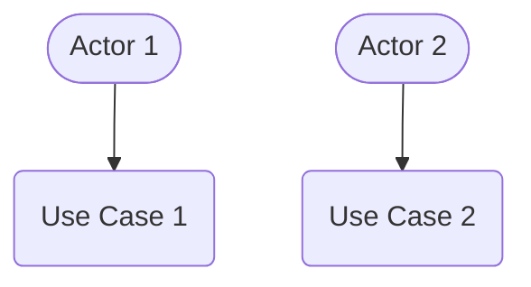
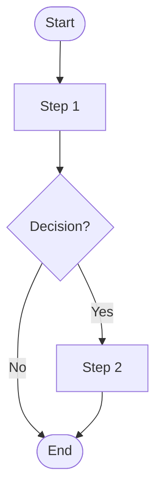
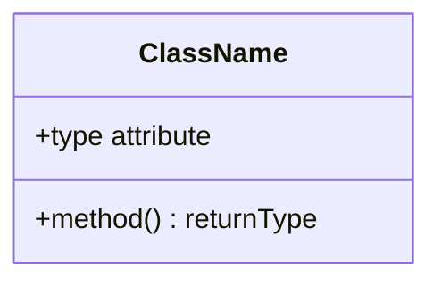
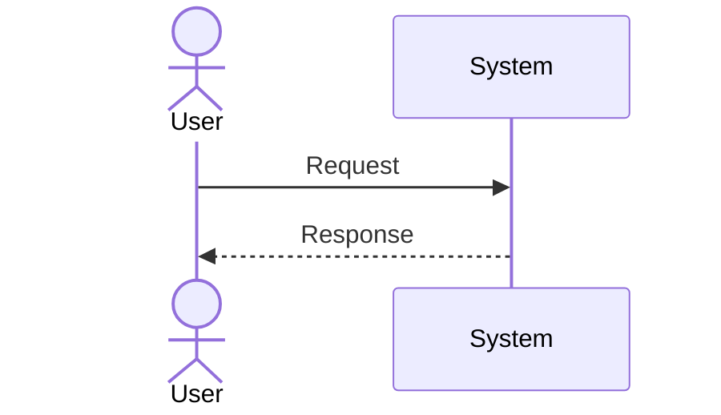
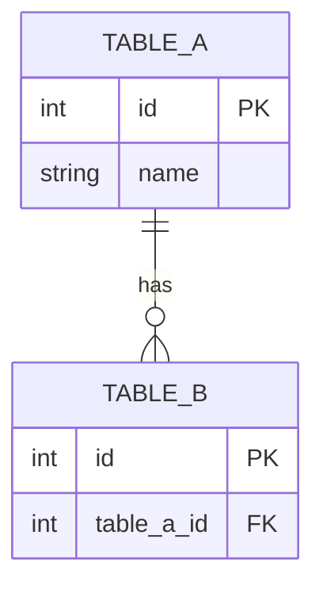

# Document Template: Software Design Document (SDD)
## [PROJECT NAME] – SDD Template

**Template Version:** v1.0.0  
**Instructions:** Replace all `[PLACEHOLDER]` values with project-specific content. Delete unused sections.

---

## 1. Introduction

### 1.1 Purpose
[Describe the purpose of this SDD. State that it transforms SRS requirements into structured technical design blueprints.]

### 1.2 Document Audience
- **System Developers:** [Role description]
- **QA / Testers:** [Role description]
- **System Administrators:** [Role description]
- **Project Supervisor:** [Role description]

### 1.3 Scope of Design
The design specifications cover:
- [Architecture boundary 1]
- [Component 1]
- [UML models included]

---

## 2. System Component Decomposition

[Briefly describe the modular structure of the system.]

```text
+-----------------------------+
|     [Presentation Layer]    |
+-------------+---------------+
              | [Protocol]
              v
+-----------------------------+
|  [Business Logic Layer]     |
+-----------------------------+
              |
              v
+-----------------------------+
|  [AI / Processing Layer]    |
+-----------------------------+
              |
              v
+-----------------------------+
|     [Database Layer]        |
+-----------------------------+
```

### 2.1 [Component 1] Module
- **Role:** [Description]
- **Sub-modules:**
  - [Sub-module A]: [Description]
  - [Sub-module B]: [Description]

### 2.2 [Component 2] Module
- **Role:** [Description]
- **Sub-modules:**
  - [Sub-module A]: [Description]

---

## 3. Design Models & UML Diagrams

### 3.1 Use Case Diagram


### 3.2 Activity Diagram


### 3.3 Class Diagram


### 3.4 Sequence Diagram


---

## 4. System Architecture

### 4.1 Architecture Overview
[Describe the rationale for the chosen architecture and its key benefits.]

### 4.2 [Layer 1] Layer
- **Technology Stack:** [Technologies used]
- **Core Responsibilities:**
  - [Responsibility 1]

### 4.3 [Layer 2] Layer
- **Technology Stack:** [Technologies used]
- **Core Responsibilities:**
  - [Responsibility 1]

---

## 5. Database Design

### 5.1 Entity Relationship Diagram (ERD)


### 5.2 Table Schemas & Data Dictionaries

#### 5.2.1 `[table_name]` Table
| Column Name | Data Type | Constraints | Description |
| :--- | :--- | :--- | :--- |
| `[column]` | `[type]` | [constraints] | [description] |

---

## 6. Database Indices

- **`idx_[table]_[column]`**: [Purpose of this index]

---

## 7. Interface Design

### 7.1 User Interface (UI) Layouts

#### 7.1.1 [Screen Name]
- **Purpose:** [What this screen is for]
- **Components:**
  - [Component 1]
  - [Component 2]

### 7.2 API Endpoint Specifications

#### 7.2.1 `[HTTP METHOD] /[route]`
- **Request Body:**
  ```json
  { "[field]": "[value]" }
  ```
- **Success Response (`200 OK`):**
  ```json
  { "[field]": "[value]" }
  ```
- **Error Response (`[4xx]`):**
  ```json
  { "error": "[message]" }
  ```

---

## Approval Sign-off

| Stakeholder Role | Name / Signature | Status | Date |
| :--- | :--- | :---: | :--- |
| Lead Architect | | PENDING | |
| QA Lead | | PENDING | |
| Project Supervisor | | PENDING | |
