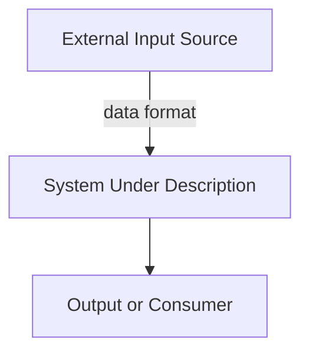

# Document Template: Software Requirements Specification (SRS)
## [PROJECT NAME] – SRS Template

**Template Version:** v1.0.0  
**Standard Reference:** IEEE Std 830-1998  
**Instructions:** Replace all `[PLACEHOLDER]` values with project-specific content.

---

## 1. Introduction

### 1.1 Purpose
[Describe the purpose of this SRS document. Identify the product whose software requirements are specified. Explain what the rest of the document covers.]

### 1.2 Document Audience
This document is structured to serve the following stakeholders:
- **Client / Sponsor:** [Role description]
- **Project Supervisor:** [Role description]
- **Development Team:** [Role description]
- **Quality Assurance Team:** [Role description]

### 1.3 Intended Objectives
- [Objective 1]
- [Objective 2]
- [Objective 3]

### 1.4 Scope of System
- **In-Scope:**
  - [Feature 1]
  - [Feature 2]
- **Out-of-Scope:**
  - [Excluded item 1]
  - [Excluded item 2]

### 1.5 Definitions, Acronyms, and Abbreviations

| Acronym / Term | Definition |
| :--- | :--- |
| [TERM] | [Definition] |

### 1.6 References
1. [Reference 1 – Standard or guideline]
2. [Reference 2 – Internal document]

---

## 2. Overall Description

### 2.1 Product Perspective
[Describe the context of the system within the broader environment.]

### 2.2 Product Functions
- [Function 1]
- [Function 2]
- [Function 3]

### 2.3 User Classes and Characteristics
- **[User Role 1]:** [Description]
- **[User Role 2]:** [Description]

### 2.4 Operating Environment
- **Server:** [OS, runtime, hardware]
- **Client:** [Browser/device requirements]

### 2.5 Design and Implementation Constraints
- [Constraint 1]
- [Constraint 2]

### 2.6 Assumptions and Dependencies
- [Assumption 1]
- [Dependency 1]

---

## 3. Functional Requirements

### 3.1 [Feature Name] (FR-01)
- **Description:** [What the feature does]
- **Inputs:** [Inputs to the feature]
- **Processing:** [Steps performed]
- **Outputs:** [Expected outcomes]

### 3.2 [Feature Name] (FR-02)
- **Description:** [What the feature does]
- **Inputs:** [Inputs to the feature]
- **Processing:** [Steps performed]
- **Outputs:** [Expected outcomes]

---

## 4. Non-Functional Requirements

### 4.1 Performance Requirements
- [Performance metric 1, e.g., response time < X seconds]
- [Throughput target]

### 4.2 Security & Privacy Requirements
- [Security requirement 1]
- [Privacy regulation compliance]

### 4.3 Reliability & Availability
- [Uptime target, e.g., 99.9%]
- [Fault tolerance requirement]

### 4.4 Interoperability & Portability
- [Integration standard 1]
- [Client compatibility requirement]

---

## 5. External Interface Requirements

### 5.1 User Interfaces
- [Screen 1 description]
- [Screen 2 description]

### 5.2 Hardware Interfaces
- [Hardware requirement 1]

### 5.3 Software Interfaces
- [Library / Framework dependency 1]

### 5.4 API & Communication Interfaces
- **Protocol:** [REST / GraphQL / gRPC]
- **Primary Routes:**
  - `[HTTP METHOD] /[route]`: [Description]

---

## Approval Sign-off

| Stakeholder Role | Name / Signature | Status | Date |
| :--- | :--- | :---: | :--- |
| Lead QA Engineer | | PENDING | |
| Lead Architect | | PENDING | |
| Project Supervisor | | PENDING | |
| Client Representative | | PENDING | |
